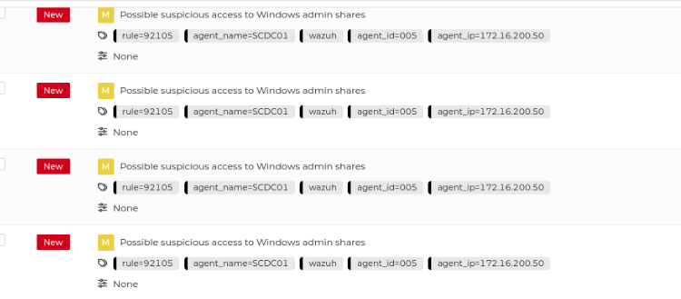
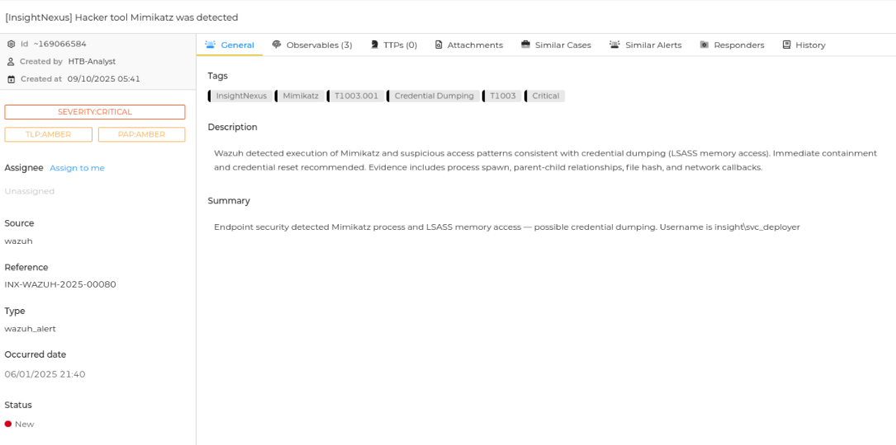
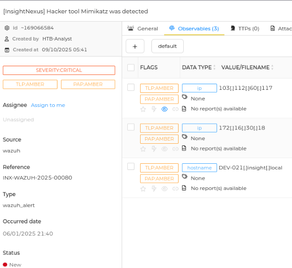

# Incident Investigation: Malware-Related Alert Triage Using TheHive

## Objective
Review and triage security alerts using TheHive to determine whether observed activity represents a security incident.

---

## Environment
- Platform: Hack The Box – SOC Analyst Path
- System(s): TheHive (Incident Response Platform)
- Tools Used: TheHive, alert dashboard
- Log Sources: Security alerts generated by monitoring tools

---

## Evidence Observed

### Alert 1: SCDC01
- Alert Source (agent_name): SCDC01 (Windows Domain Controller)
   - Monitoring agent: Wazuh 
   - Alert type / rule description: wazuh_alert; Possible suspicious access to Windows admin shares
   - Severity: MEDIUM
   - Occurrences: 4 
   - MITRE Tactic: Lateral Movement
   - MITRE Technique: SMB/Windows Admin Shares (T1021.002)
   - Indicators:
      - User account: NT AUTHORITY\SYSTEM
      - Process: C:\Windows\System32\dfsrs.exe
      - Protocol: TCP
      - Source IP: fe80:0:0:0:4535:7f0:7fe0:e8c5
      - Destination IP: fe80:0:0:0:4535:7f0:7fe0:e8c5
      - Destination Port: 135
   - Location: EventChannel

 
### Alert 2: DEV-021.insight.local (Mimikatz Detection)
- Alert Source (agent_name): insight/svc_deployer
   - Monitoring agent: Wazuh
   - Alert type / rule description: wazuh_alert; Execution of Mimikatz and LSASS memory access
   - Severity: CRITICAL
   - Occurrences: 1
   - MITRE Tactic: Credential Access
   - MITRE Technique: OS Credential Dumping - LSASS Memory (T1003.001)
   - Observables
      - IP 103.112.60.117
      - IP 172.16.30.18
      - Hostname: DEV-021.insight.local  

   

  
---

## Analysis
- **SCDC01 Alerts:** The repeated access attempts to Windows administrative shares by `NT AUTHORITY\SYSTEM` using `dfsrs.exe` appear consistent with DFS replication but could indicate lateral movement if unexepected.  The pattern of repeated connections (4 occurrences) warrants monitoring and correlation with other alerts.
- **DEV-021 Alert:** Detection of Mimikatz accessing LSASS memory is critical. This activity matches MITRE ATT&CK T1003.001, indicating potential credential theft. Even a single occurrence on a host is serious due to the risk of privilege escalation and lateral movement. The source IPs and hostnames help identify affected endpoints and possible attacker infrastructure.
- Overall, the behavior observed aligns with known attack techniques: Lateral movement and credential access. The Mimikatz alert is **malicious**, while the DFS activity requires contextual verification to determine if it is benign or suspicious. 
---

## Conclusion & Response
- **Final Classification:** Security Incident
- **Incident Type:** Credential Theft / Suspicious Lateral Movement
- **Severity:** Medium (SCDC01) / Critical (DEV-021)

---

**Recommended Actions:**
- Isolate DEV-021 to prevent credential theft propagation.
- Verify if SCDC01 DFS replication activity is expected; monitor for unsual lateral movement.
- Investigate source IPs 103.112.60.117 and 172.16.30.18 for attacker activity.
- Reset potentially compromised credentials and escalate to SOC Tier 2.
- Continue monitoring both endpoints for further suspicious activity. 
---

## What I Learned
- How to triage Wazuh alerts in TheHive for multiple endpoints.
- How to differentiate benign administrative traffic from malicious lateral movement.
- How to map alert activity to MITRE ATT&CK tactics and techniques.
